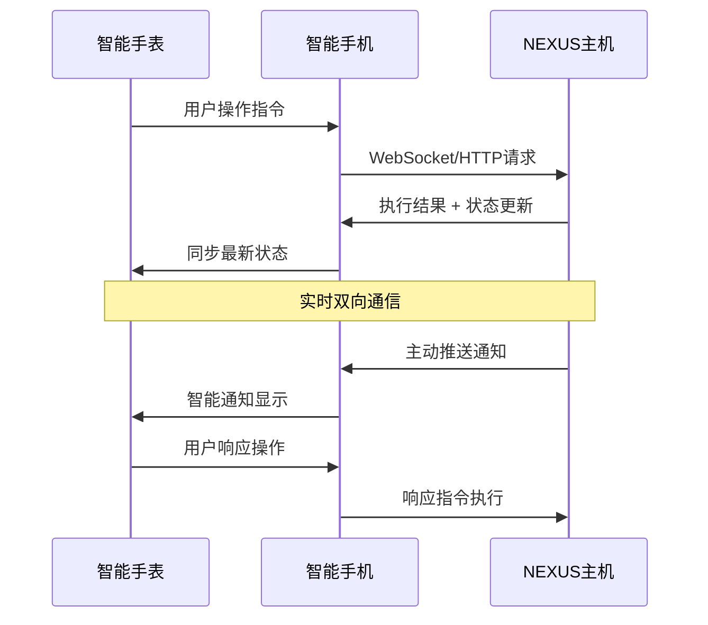

# Changlee-Link - 跨平台智能手表遥控系统

## 🎯 项目核心目标

构建一个运行在主流智能手表上的**"轻量级前端 (Thin Client)"**，作为NEXUS主机的"远程遥控器"和"数据显示屏"，实现**"人机共生"**的无缝交互体验。

## 🏗️ 整体架构

```
┌─────────────────┐    ┌─────────────────┐    ┌─────────────────┐
│   智能手表       │    │   智能手机       │    │   NEXUS主机     │
│  (Thin Client)  │◄──►│  (Relay Hub)    │◄──►│  (Main Server)  │
│                 │    │                 │    │                 │
│ • UI显示        │    │ • 数据中继      │    │ • 核心计算      │
│ • 触控交互      │    │ • 网络通信      │    │ • AI服务        │
│ • 健康监测      │    │ • 状态缓存      │    │ • 系统管理      │
└─────────────────┘    └─────────────────┘    └─────────────────┘
```

## 📱 支持平台

### 平台一：Apple Watch (watchOS 生态)

**目标设备**：Apple Watch Series 4 及更新型号  
**开发环境**：macOS + Xcode

#### 核心技术栈

| 技术组件 | 技术选型 | 用途说明 |
|---------|---------|---------|
| **编程语言** | Swift | 苹果生态首选现代编程语言，安全、快速、表现力强 |
| **用户界面** | SwiftUI | 声明式UI框架，跨苹果设备的美观响应式界面 |
| **生命周期管理** | WatchKit | 管理应用生命周期、后台任务、系统事件响应 |
| **设备间通信** | WatchConnectivity Framework | 手表与iPhone的官方数据桥梁 |
| **健康数据** | HealthKit API | 安全读取心率、血氧、睡眠等健康数据 |
| **网络请求** | URLSession / Alamofire | iPhone端作为通讯中继站与NEXUS通信 |

#### WatchConnectivity 核心功能

```swift
// 即时消息 - 需要立即响应的指令
sendMessage(message: [String: Any]) { reply in
    // 处理NEXUS主机的即时响应
}

// 状态同步 - 自动在合适时机同步数据
updateApplicationContext(context: [String: Any])

// 后台传输 - 传输大数据块或文件
transferUserInfo(userInfo: [String: Any])
transferFile(file: URL, metadata: [String: Any])
```

### 平台二：Android / Wear OS (Google/Samsung 生态)

**目标设备**：运行Wear OS 3+的手表 (Samsung Galaxy Watch 4+, Google Pixel Watch等)  
**开发环境**：Android Studio

#### 核心技术栈

| 技术组件 | 技术选型 | 用途说明 |
|---------|---------|---------|
| **编程语言** | Kotlin | Google官方推荐，简洁安全，与Java完全兼容 |
| **用户界面** | Jetpack Compose for Wear OS | 现代化声明式UI工具包，SwiftUI的安卓对标 |
| **生命周期管理** | Android Jetpack Lifecycle | 适应Wear OS低功耗、长时运行环境 |
| **设备间通信** | Wearable Data Layer API | 连接Wear OS手表和Android手机的官方数据总线 |
| **健康数据** | Health Connect API / Health Services | 读取安卓健康平台的多源健康数据 |
| **网络请求** | OkHttp & Retrofit | Android手机端的强大网络通信库 |

#### Wearable Data Layer 核心功能

```kotlin
// 快速响应消息 - 适合RPC远程过程调用
MessageClient.sendMessage(nodeId, path, data)

// 共享数据字典 - 手表和手机都可读写的同步数据
DataClient.putDataItem(putDataRequest)

// 流式传输 - 大数据或文件传输
ChannelClient.openChannel(nodeId, path)
```

### 平台三：Huawei Watch (HarmonyOS 生态)

**目标设备**：运行HarmonyOS的华为手表  
**开发环境**：HUAWEI DevEco Studio

#### 核心技术栈

| 技术组件 | 技术选型 | 用途说明 |
|---------|---------|---------|
| **编程语言 & UI** | ArkTS (基于TypeScript) | 华为定制的声明式UI开发语言，Web开发者友好 |
| **应用框架** | ArkUI | 专为鸿蒙多设备设计的丰富UI组件框架 |
| **设备间通信** | 分布式软总线 & 分布式任务调度 | 高维度通信哲学，超越点对点通信 |
| **健康数据** | HUAWEI Health Kit | 华为运动健康平台的丰富健康与运动数据 |
| **无缝交互** | 原子化服务 & 万能卡片 | 鸿蒙UI杀手锏，零点击交互体验 |

#### 分布式通信核心功能

```typescript
// 服务迁移 - 动态迁移手机服务到手表
ServiceMigration.migrateService(serviceId, targetDevice)

// 远程过程调用 - 像调用本地函数一样调用手机函数
RemoteProcedureCall.invoke(deviceId, methodName, parameters)

// 原子化服务 - 独立的高频功能服务
AtomicService.createCard(cardType, cardData)
```

## 🎮 核心功能设计

### 1. 主控面板 (Main Dashboard)

```
┌─────────────────────────────┐
│  🏠 NEXUS Remote Control    │
├─────────────────────────────┤
│  📊 系统状态                │
│  ├─ 🟢 在线: 5个系统        │
│  ├─ 🟡 离线: 1个系统        │
│  └─ 🔒 受限: 3个系统        │
├─────────────────────────────┤
│  ⚡ 快速操作                │
│  ├─ 🌐 远程控制             │
│  ├─ 🤖 RAG问答              │
│  ├─ 🐱 唤醒长离             │
│  └─ 📝 查看日志             │
└─────────────────────────────┘
```

### 2. 健康监测集成 (Health Integration)

```
┌─────────────────────────────┐
│  💓 健康 & 工作状态         │
├─────────────────────────────┤
│  心率: 72 BPM 🟢           │
│  血氧: 98% 🟢              │
│  压力: 低 🟢               │
├─────────────────────────────┤
│  🧠 专注度分析              │
│  当前: 高专注 (85%)         │
│  建议: 继续保持             │
└─────────────────────────────┘
```

### 3. 智能通知 (Smart Notifications)

```
┌─────────────────────────────┐
│  🔔 NEXUS 通知中心          │
├─────────────────────────────┤
│  🚨 系统告警                │
│  服务器CPU使用率过高        │
│  [查看详情] [忽略]          │
├─────────────────────────────┤
│  🐱 长离消息                │
│  "主人，该休息一下了~"      │
│  [回复] [稍后提醒]          │
└─────────────────────────────┘
```

## 🔄 数据流架构

### 通信协议设计



### 数据同步策略

| 数据类型 | 同步方式 | 频率 | 优先级 |
|---------|---------|------|--------|
| **系统状态** | 实时推送 | 5秒 | 高 |
| **健康数据** | 定时上传 | 1分钟 | 中 |
| **操作日志** | 批量同步 | 5分钟 | 低 |
| **紧急告警** | 即时推送 | 实时 | 最高 |

## 🎨 UI/UX 设计原则

### 1. 极简主义 (Minimalism)
- **一屏一功能**：每个界面只专注一个核心功能
- **大按钮设计**：适配小屏幕触控操作
- **高对比度**：确保各种光线条件下的可读性

### 2. 手势优先 (Gesture-First)
- **滑动切换**：左右滑动切换功能模块
- **长按操作**：长按进入详细设置
- **旋转表冠**：快速滚动和数值调节

### 3. 情境感知 (Context-Aware)
- **智能推荐**：根据时间和使用习惯推荐操作
- **自适应界面**：根据当前系统状态调整显示内容
- **预测性加载**：提前加载可能需要的数据

## 🔋 电量优化策略

### 1. 智能休眠 (Smart Sleep)
```typescript
// 根据使用模式智能调整更新频率
const updateInterval = calculateOptimalInterval(
    userActivity,
    batteryLevel,
    systemPriority
);
```

### 2. 数据压缩 (Data Compression)
```swift
// 使用高效的数据序列化格式
let compressedData = try JSONEncoder().encode(statusData)
let optimizedPayload = compress(compressedData)
```

### 3. 后台限制 (Background Limits)
```kotlin
// 智能后台任务管理
WorkManager.enqueueUniquePeriodicWork(
    "nexus-sync",
    ExistingPeriodicWorkPolicy.KEEP,
    periodicWorkRequest
)
```

## 🚀 开发路线图

### Phase 1: 基础架构 (4周)
- [ ] 跨平台项目结构搭建
- [ ] 基础通信协议实现
- [ ] 核心UI组件开发

### Phase 2: 核心功能 (6周)
- [ ] 系统状态监控
- [ ] 远程控制操作
- [ ] 健康数据集成

### Phase 3: 智能特性 (4周)
- [ ] AI驱动的智能通知
- [ ] 预测性用户界面
- [ ] 个性化推荐系统

### Phase 4: 优化完善 (2周)
- [ ] 性能优化
- [ ] 电量管理
- [ ] 用户体验测试

## 📦 项目结构

```
Changlee-Link/
├── README.md                 # 项目说明文档
├── docs/                     # 详细文档
│   ├── api-specification.md  # API接口规范
│   ├── ui-design-guide.md    # UI设计指南
│   └── deployment-guide.md   # 部署指南
├── platforms/                # 平台特定代码
│   ├── watchos/             # Apple Watch实现
│   │   ├── ChangleeLink.xcodeproj
│   │   ├── ChangleeLink WatchKit App/
│   │   └── ChangleeLink WatchKit Extension/
│   ├── wearos/              # Wear OS实现
│   │   ├── app/
│   │   ├── wear/
│   │   └── build.gradle
│   └── harmonyos/           # HarmonyOS实现
│       ├── entry/
│       ├── features/
│       └── build-profile.json5
├── shared/                   # 共享代码和资源
│   ├── protocols/           # 通信协议定义
│   ├── models/              # 数据模型
│   └── assets/              # 共享资源文件
└── tools/                   # 开发工具
    ├── build-scripts/       # 构建脚本
    ├── testing/             # 测试工具
    └── deployment/          # 部署工具
```

---

**项目愿景**：让NEXUS的强大功能，触手可及 ⌚  
**开发理念**：简约而不简单，智能而不复杂 🧠  
**用户体验**：人机共生，无缝交互 🤝